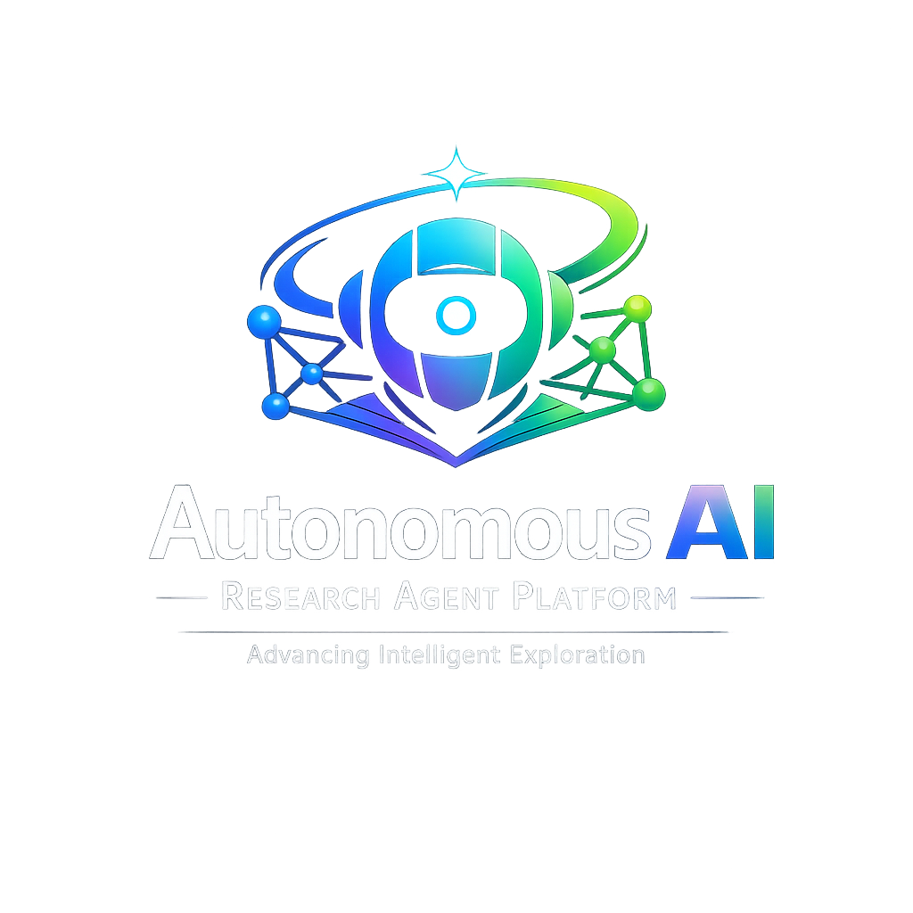

# Autonomous AI Research Agent Platform

<div align="center">
  
  
  <h1>🚀 AI Research Agent Platform</h1>
  
  <p>
    <b>Engineered by <a href="https://linkedin.com/in/zaidsuhail">Muhammad Zaid Suhail</a></b><br>
    <i>Applied AI & Electrical Engineer</i>
  </p>

  <p align="center">
    
  </p>

  <a href="https://zaid-ai-research-agent.streamlit.app/">
    
  </a>
  <a href="https://linkedin.com/in/zaidsuhail">
    
  </a>
  <a href="https://github.com/zaidsuhail82">
    
  </a>

  <br />
</div>
An advanced RAG-based multi-agent system that autonomously discovers, analyzes, and summarizes scientific research papers...
An advanced multi-agent AI system that autonomously discovers, analyzes, and summarizes scientific research papers using Retrieval-Augmented Generation (RAG), vector databases, and large language models.

This project demonstrates how modern AI systems can combine autonomous agents, knowledge retrieval, and reasoning to build a scalable AI research assistant.

---

## Project Overview

The Autonomous AI Research Agent Platform is designed to simulate a real-world AI system used in research labs and technology companies.  

It integrates multiple AI components including:

- Multi-agent orchestration
- Research paper ingestion
- Vector-based semantic search
- Retrieval-Augmented Generation (RAG)
- Large language model reasoning
- Production-ready API services

The system can automatically search for research papers, extract knowledge, store embeddings in a vector database, and generate structured insights in response to user queries.

Example query:

```

"What are the latest machine learning techniques for autonomous driving?"

```

The system will return:

- Relevant research papers
- Summaries of key methods
- Important technical insights
- Future research directions

---

## System Architecture

The platform follows a modular AI system architecture.

```

User
↓
FastAPI API Service
↓
Agent Orchestrator
↓
Search Agent → arXiv API
↓
Document Processing Pipeline
↓
Embedding Model
↓
Vector Database (FAISS)
↓
Retriever
↓
Large Language Model
↓
Research Report Generator
↓
User Response

```

---

## Core Components

### 1. Research Paper Ingestion

Automatically collects research papers from sources such as:

- arXiv
- research datasets
- scientific repositories

Responsibilities:

- Fetch papers
- Extract text
- Store metadata

---

### 2. Document Processing Pipeline

Transforms raw papers into knowledge-ready format.

Pipeline:

```

Paper
↓
Text Extraction
↓
Chunking
↓
Embedding
↓
Vector Database Storage

```

---

### 3. Vector Database

Stores embeddings for semantic search.

Technology used:

- FAISS

Capabilities:

- Similarity search
- Knowledge retrieval
- Efficient large-scale embedding storage

---

### 4. Multi-Agent AI System

The platform includes several specialized agents.

#### Search Agent
Finds relevant research papers from external sources.

#### Retrieval Agent
Searches the vector database for relevant knowledge.

#### Analysis Agent
Analyzes retrieved papers and extracts key insights.

#### Report Agent
Generates structured research reports for users.

---

### 5. Retrieval-Augmented Generation (RAG)

The system uses RAG to combine:

- Retrieved knowledge
- LLM reasoning

Process:

```

User Query
↓
Embedding
↓
Vector Similarity Search
↓
Relevant Knowledge Retrieval
↓
LLM Reasoning
↓
Structured Response

```

---

### 6. API Layer

A production-ready API built using FastAPI.

Example endpoint:

```

POST /research/query

````

Example request:

```json
{
  "query": "Reinforcement learning for autonomous vehicles"
}
````

Example response:

```json
{
  "summary": "...",
  "key_papers": [...],
  "insights": [...]
}
```

---

## Project Structure

```
ai-research-agent-platform
│
├── agents
│   ├── search_agent.py
│   ├── retrieval_agent.py
│   ├── analysis_agent.py
│   └── report_agent.py
│
├── rag
│   ├── embeddings.py
│   ├── vector_store.py
│   └── retriever.py
│
├── data_pipeline
│   ├── paper_ingestion.py
│   └── document_processor.py
│
├── models
│   └── llm_interface.py
│
├── api
│   ├── main.py
│   └── routes.py
│
├── config
│   └── settings.py
│
├── tests
│
├── docs
│
├── docker
│   ├── Dockerfile
│   └── docker-compose.yml
│
├── requirements.txt
└── README.md
```

---

## Technologies Used

Programming Language:

* Python

Machine Learning:

* SentenceTransformers
* PyTorch

Vector Database:

* FAISS

AI Frameworks:

* LangChain

Backend:

* FastAPI

Infrastructure:

* Docker

Data Processing:

* Pandas
* NumPy

---

## Installation

Clone the repository:

```
git clone https://github.com/YOUR_USERNAME/ai-research-agent-platform.git
cd ai-research-agent-platform
```

Create virtual environment:

```
python -m venv venv
```

Activate environment:

Windows:

```
venv\Scripts\activate
```

Install dependencies:

```
pip install -r requirements.txt
```

---

## Running the System

Example pipeline execution:

```
python data_pipeline/paper_ingestion.py
```

Future API deployment:

```
uvicorn api.main:app --reload
```

---

## Future Improvements

* Distributed vector databases
* Multi-agent collaboration frameworks
* Autonomous research planning agents
* Real-time knowledge updates
* Cloud deployment
* GPU inference pipelines

---

## Project Goals

This project aims to demonstrate advanced AI engineering techniques including:

* AI agent orchestration
* retrieval augmented generation
* production AI architecture
* scalable knowledge systems
* modern ML infrastructure

---

## Author

M. Zaid Suhail

M.Sc. Applied Artificial Intelligence

M.Sc. Electrical Engineering

Research interests:

* Artificial Intelligence
* Autonomous Systems
* Machine Learning
* Robotics
* AI Infrastructure

---
